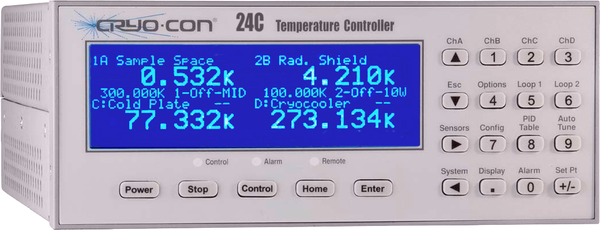

# CryoCon library



This library is used to control basic features of a CryoCon temperature
controller. It is composed of a core library, an optional simulator and
an optional [tango](https://tango-controls.org/) device server.

It has been tested with M32 and M24C models, but should work with other models.

It can be used with either the ETH or the serial line connection (read below
on the recommended way to setup a serial line connection)

## Installation

From within your favorite python environment type:

`$ pip install cryocon`


## Library

The core of the cryocon library consists of CryoCon object.
To create a CryoCon object you need to pass a communication object.

The communication object can be any object that supports a simple API
consisting of two methods (either the sync or async version is supported):

* `write_readline(buff: bytes) -> bytes` *or*

  `async write_readline(buff: bytes) -> bytes`

* `write(buff: bytes) -> None` *or*

  `async write(buff: bytes) -> None`

A library that supports this API is [sockio](https://pypi.org/project/sockio/)
(cryocon comes pre-installed so you don't have to worry about installing it).

This library includes both async and sync versions of the TCP object. It also
supports a set of features like reconnection and timeout handling.

Here is how to connect to a cryocon controller:

```python
import asyncio

from sockio.aio import TCP
from cryocon import CryoCon


async def main():
    tcp = TCP("192.168.1.123", 5000)  # use host name or IP
    cryo = CryoCon(tcp)

    idn = await cryo.idn()
    name = await cryo.name()
    print("Connected to {} ({})".format(idn, name))

    # channel access:
    temp_A = await cryo['A'].temperature()
    unit = await cryo['A'].unit()
    print("Channel A temperature: {}{}".format(temp_A, unit))

    # loop access:
    source_1 = await cryo[1].source()
    print("Loop 1 source: {}".format(source_1))

    # activate control
    await cryo.control(True)

    # hardware only accepts queries every 100ms. Yo can, however,
    # group queries in single request:
    async with cryo as group:
        cryo.idn()
        cryo.control()
        cryo['A'].temperature()
    idn, ctrl, temp_A = group.replies


asyncio.run(main())
```

#### Serial line

To access a serial line based CryoCon device it is strongly recommended you spawn
a serial to tcp bridge using [ser2net](https://linux.die.net/man/8/ser2net) or
[socat](https://linux.die.net/man/1/socat)

Assuming your device is connected to `/dev/ttyS0` and the baudrate is set to 19200,
here is how you could use socat to expose your device on the machine port 5000:

`socat -v TCP-LISTEN:5000,reuseaddr,fork file:/dev/ttyS0,rawer,b19200,cs8,eol=10,icanon=1`

It might be worth considering starting socat or ser2net as a service using
[supervisor](http://supervisord.org/) or [circus](https://circus.rtfd.io/).

### Simulator

A CryoCon simulator is provided.

Before using it, make sure everything is installed with:

`$ pip install cryocon[simulator]`

The [sinstruments](https://pypi.org/project/sinstruments/) engine is used.

To start a simulator you need to write a YAML config file where you define
how many devices you want to simulate and which properties they hold.

The following example exports 2 hardware devices. The first is a minimal
configuration using default values and the second defines some initial values
explicitly:

```yaml
# config.yml

devices:
- class: CryoCon
  package: cryocon.simulator
  transports:
  - type: tcp
    url: :5000

- class: CryoCon
  package: cryocon.simulator
  transports:
  - type: serial
    url: /tmp/cryocon
  "*idn": Cryo-con,24C,11223344,1.02A
  channels:
  - id: A
    unit: K
  - id: B
    unit: K
  loops:
  - id: 1
    source: A
    type: MAN
  distc: 4
  lockout: OFF
  remled: ON
  control: OFF
```

To start the simulator type:

```terminal
$ sinstruments-server -c ./config.yml --log-level=DEBUG
2020-05-14 16:02:35,004 INFO  simulator: Bootstraping server
2020-05-14 16:02:35,004 INFO  simulator: no backdoor declared
2020-05-14 16:02:35,004 INFO  simulator: Creating device CryoCon ('CryoCon')
2020-05-14 16:02:35,080 INFO  simulator.CryoCon[('', 5000)]: listening on ('', 5000) (newline='\n') (baudrate=None)
2020-05-14 16:02:35,080 INFO  simulator: Creating device CryoCon ('CryoCon')
2020-05-14 16:02:35,081 INFO  simulator.CryoCon[('', 5001)]: listening on ('', 5001) (newline='\n') (baudrate=None)
```

(To see the full list of options type `sinstruments-server --help`)

You can access it as you would a real hardware:

```terminal
$ nc localhost 5000
*IDN?
Cryo-con,24C,204683,1.01A
```

or using the library:
```python
$ python
>>> from sockio.sio import TCP   # use synchronous socket in the CLI!
>>> from cryocon import CryoCon
>>> cryo = CryoCon(TCP('localhost', 5000))
>>> print(cryo.idn())
Cryo-con,24C,204683,1.01A
```

### Tango server

A [tango](https://tango-controls.org/) device server is also provided.

Make sure everything is installed with:

`$ pip install cryocon[tango-ds]`

Register a cryocon tango server in the tango database:
```
$ tangoctl server add -s CryoConTempController/test -d CryoConTempController test/cryocon/1
$ tangoctl device property write -d test/cryocon/1 -p address -v "tcp://192.168.123:5000"
```

(the above example uses [tangoctl](https://pypi.org/project/tangoctl/). You would need
to install it with `pip install tangoctl` before using it. You are free to use any other
tango tool like [fandango](https://pypi.org/project/fandango/) or Jive)

Launch the server with:

```terminal
$ CryoConTempController test
```

## TODO

* Add `on_connection_made` callback to initialize controller with:
  * unit=`K`
  * cache IDN, fw revision, hw revision
  * should we cache system:name? and input:name? in theory in could be modified
    directly with the hardware front panel